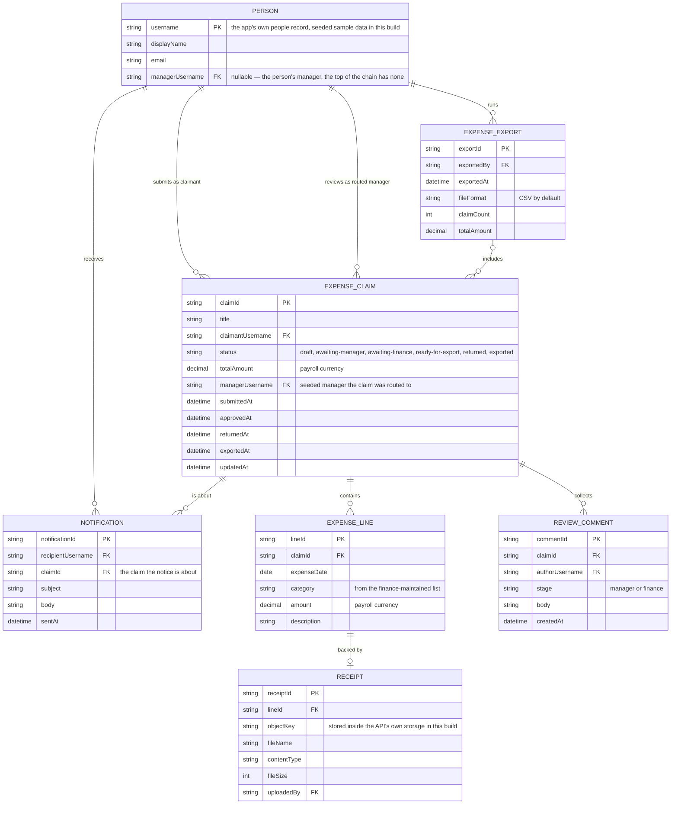

# Expense Claims — Domain Model

Expense claims and their lines, the two review gates that move them, and the export that hands approved claims to payroll. In this build the app is self-contained: it holds its own people records — seeded with sample data standing in for the company directory — and records its email notices in its own database instead of delivering them.

- Receipt bytes stay inside the API's own storage in this build; the database stores only the object key and upload metadata.
- A submitted claim routes to the claimant's manager as recorded in the app's people data; manager approval moves it to the finance queue, finance approval readies it for export.
- Notifications are recorded, not delivered: the API writes a notification row for each recipient at every step, standing in for email.
- An employee may edit a claim only while it is a draft or returned; everything after submission happens through the review gates.