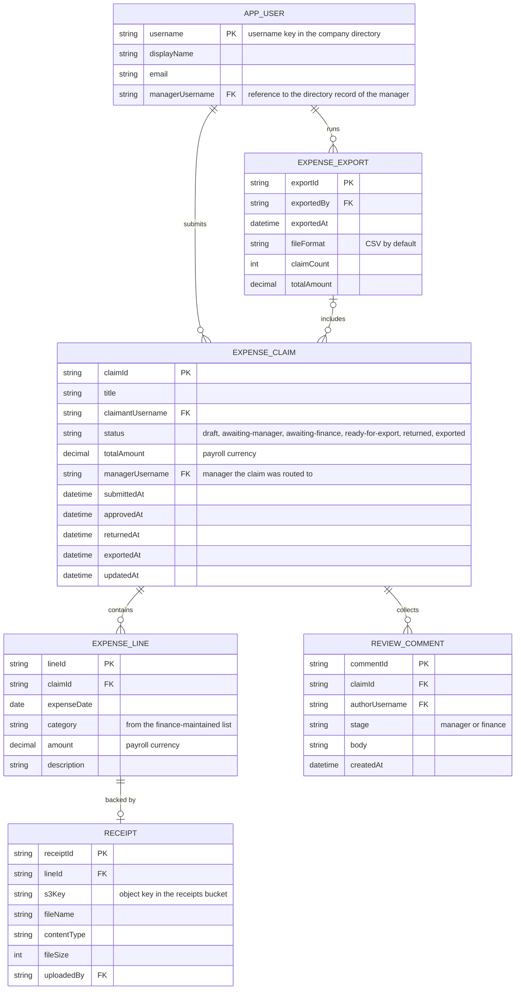

# Expense Claims — Domain Model

Expense claims and their lines, the two review gates that move them, and the export that hands approved claims to payroll. People, teams and managers live in the company directory — this database stores only stable references to them.

- Receipt bytes live in S3; the database stores only the object key and upload metadata.
- A submitted claim routes to the claimant's manager as recorded in the directory; manager approval moves it to the finance queue, finance approval readies it for export.
- An employee may edit a claim only while it is a draft or returned; everything after submission happens through the review gates.