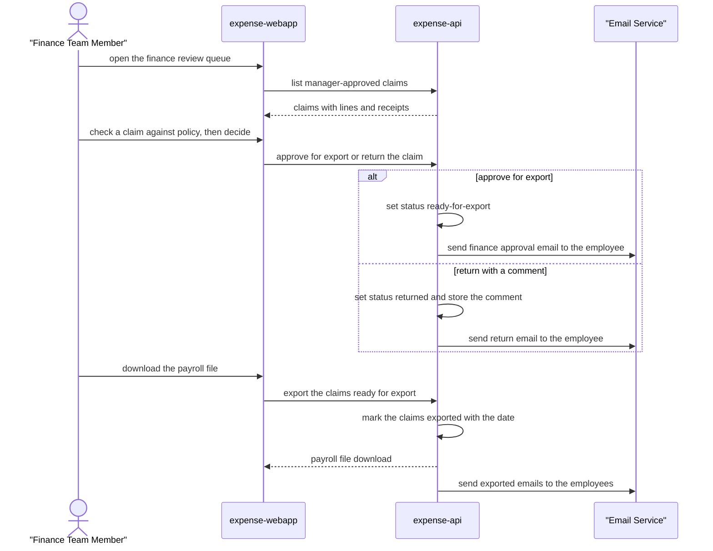

# Finance review and payroll export

A finance team member reviews manager-approved claims against policy, returns faulty ones for correction, approves the rest for export, and downloads the payroll file of everything approved.

