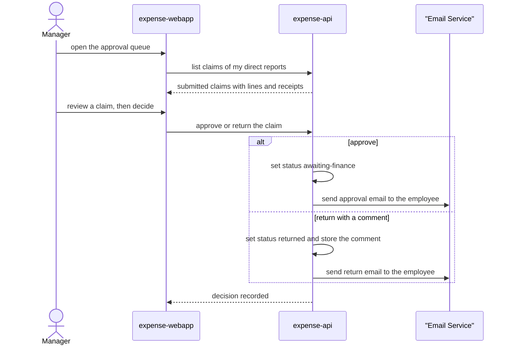

# Manager approval

A manager reviews the claims their direct reports have submitted and either approves each one — sending it to finance review — or returns it with a comment for correction.

```mermaid
sequenceDiagram
    actor Manager
    participant expense-webapp
    participant expense-api
    participant email as "Email Service"

    Manager->>expense-webapp: open the approval queue
    expense-webapp->>expense-api: list claims of my direct reports
    expense-api-->>expense-webapp: submitted claims with lines and receipts
    Manager->>expense-webapp: review a claim, then decide
    expense-webapp->>expense-api: approve or return the claim
    alt approve
        expense-api->>expense-api: set status awaiting-finance
        expense-api->>email: send approval email to the employee
    else return with a comment
        expense-api->>expense-api: set status returned and store the comment
        expense-api->>email: send return email to the employee
    end
    expense-api-->>expense-webapp: decision recorded
```