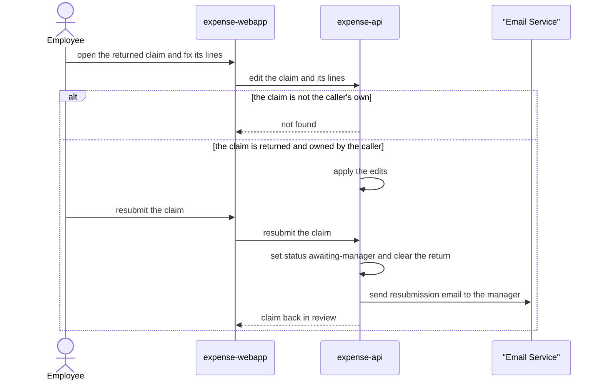

# Resubmit a returned claim

An employee corrects a claim a manager or finance returned and resubmits it, sending it back through the review gates.

```mermaid
sequenceDiagram
    actor Employee
    participant expense-webapp
    participant expense-api
    participant email as "Email Service"

    Employee->>expense-webapp: open the returned claim and fix its lines
    expense-webapp->>expense-api: edit the claim and its lines
    alt the claim is not the caller's own
        expense-api-->>expense-webapp: not found
    else the claim is returned and owned by the caller
        expense-api->>expense-api: apply the edits
        Employee->>expense-webapp: resubmit the claim
        expense-webapp->>expense-api: resubmit the claim
        expense-api->>expense-api: set status awaiting-manager and clear the return
        expense-api->>email: send resubmission email to the manager
        expense-api-->>expense-webapp: claim back in review
    end
```