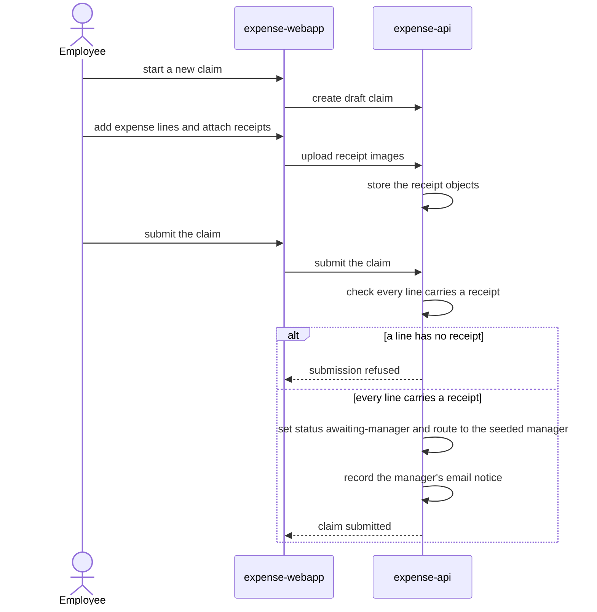

# Submit an expense claim

An employee builds a claim from dated, categorized expense lines with receipt images and submits it, which routes it to their manager for approval.

```mermaid
sequenceDiagram
    actor Employee
    participant expense-webapp
    participant expense-api

    Employee->>expense-webapp: start a new claim
    expense-webapp->>expense-api: create draft claim
    Employee->>expense-webapp: add expense lines and attach receipts
    expense-webapp->>expense-api: upload receipt images
    expense-api->>expense-api: store the receipt objects
    Employee->>expense-webapp: submit the claim
    expense-webapp->>expense-api: submit the claim
    expense-api->>expense-api: check every line carries a receipt
    alt a line has no receipt
        expense-api-->>expense-webapp: submission refused
    else every line carries a receipt
        expense-api->>expense-api: set status awaiting-manager and route to the seeded manager
        expense-api->>expense-api: record the manager's email notice
        expense-api-->>expense-webapp: claim submitted
    end
```